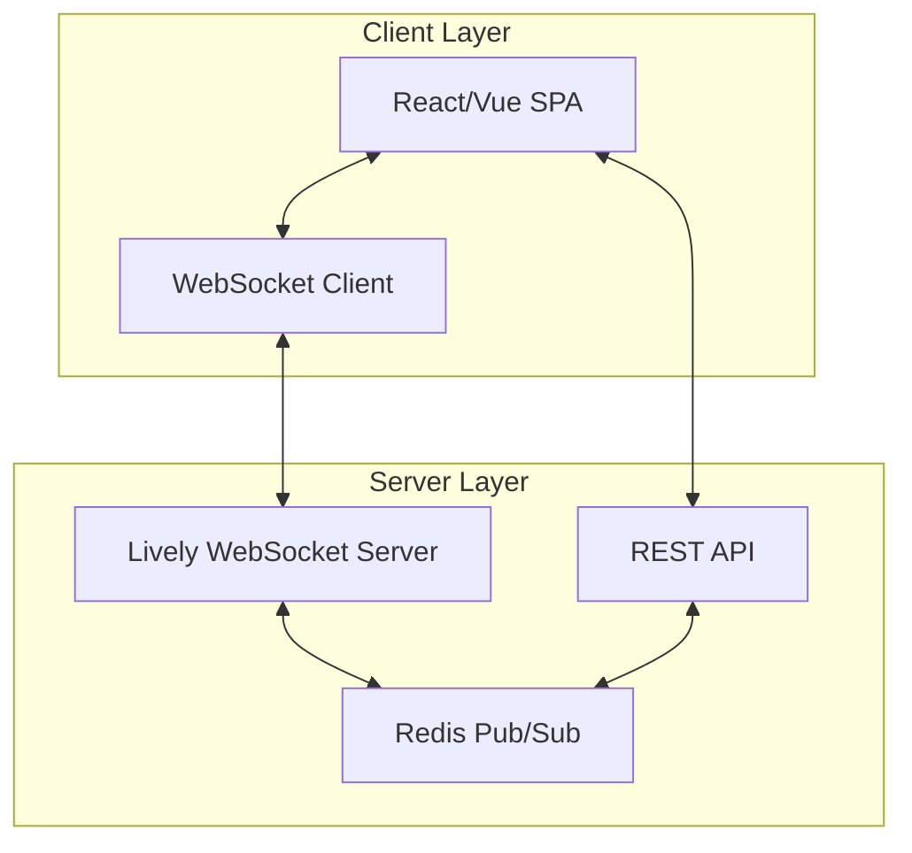
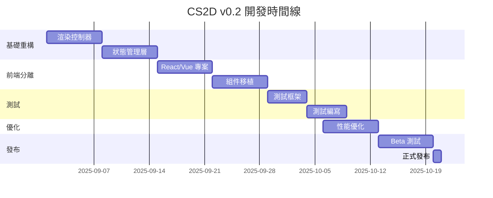

# 🎯 CS2D Version 0.2 - Architecture Refactoring Plan

## 📅 版本資訊

- **版本號**: 0.2.0-alpha
- **代號**: "Phoenix" (從灰燼中重生)
- **計劃發布**: 2025年9月
- **主題**: 解決架構問題，實現真正的統一應用

## 🔴 版本 0.1 現狀評估

### 當前問題

1. **🚨 關鍵架構問題**
   - Lively 框架無限渲染循環
   - 被迫採用分散式服務架構
   - 服務間整合不完整

2. **⚠️ 技術債務**
   - 多個半完成的架構實現並存
   - 沒有自動化測試
   - Static server 健康狀態不穩定
   - 文檔與實際不符

3. **📊 現有元件狀態**
   ```
   ✅ 運行中：Docker 容器、Redis、大廳系統
   ⚠️ 不穩定：靜態服務器、遊戲整合
   ❌ 缺失：測試框架、統一架構、監控系統
   ```

## 🎯 版本 0.2 核心目標

### 1. **解決無限渲染問題** [P0 - 最高優先級]

### 2. **實現真正的統一架構** [P0]

### 3. **建立測試基礎設施** [P1]

### 4. **改善開發體驗** [P1]

### 5. **性能優化** [P2]

## 🏗️ 技術架構重構方案

### 方案 A: **混合式 SPA 架構** (建議方案)



**實施步驟：**

1. 將前端完全分離為獨立 SPA
2. Lively 僅作為 WebSocket 服務器
3. 使用 React/Vue 處理所有客戶端渲染
4. REST API 處理非實時請求

### 方案 B: **智能渲染控制** (保留 Lively)

```ruby
# lib/render_controller.rb
class RenderController
  def initialize(view)
    @view = view
    @render_queue = []
    @rendering = false
    @last_render_time = Time.now
    @min_render_interval = 0.1
  end

  def request_update(priority: :normal)
    return if @rendering

    @render_queue << {
      time: Time.now,
      priority: priority
    }

    process_queue if can_render?
  end

  private

  def can_render?
    Time.now - @last_render_time > @min_render_interval
  end

  def process_queue
    return if @render_queue.empty?

    @rendering = true
    @render_queue.clear

    @view.update!

    @last_render_time = Time.now
    @rendering = false
  end
end
```

### 方案 C: **微前端架構**

將應用拆分為獨立的微前端：

- **Lobby 微前端**: 大廳和房間管理
- **Game 微前端**: 遊戲主體
- **Editor 微前端**: 地圖編輯器
- **Admin 微前端**: 管理後台

## 📋 實施計劃

### 第一階段：基礎重構 (第1-2週)

```yaml
任務清單:
  - [ ] 創建渲染控制器
  - [ ] 實施更新隊列機制
  - [ ] 添加渲染防護裝置
  - [ ] 建立狀態管理層
  - [ ] 實現事件節流
```

**具體代碼變更：**

```ruby
# application.rb
require_relative "lib/render_controller"
require_relative "lib/state_manager"

class Application < Lively::Application
  include RenderController
  include StateManager

  configure do
    enable :render_protection
    set :max_render_rate, 10 # 每秒最多10次渲染
  end
end
```

### 第二階段：前端分離 (第3-4週)

```yaml
任務清單:
  - [ ] 創建 React/Vue 專案
  - [ ] 實現客戶端路由
  - [ ] 建立 WebSocket 客戶端
  - [ ] 移植現有 UI 組件
  - [ ] 實現狀態管理 (Redux/Vuex)
```

**目錄結構：**

```
cs2d/
├── frontend/               # 新增前端專案
│   ├── src/
│   │   ├── components/   # React/Vue 組件
│   │   ├── views/        # 頁面視圖
│   │   ├── store/        # 狀態管理
│   │   ├── services/     # API 服務
│   │   └── ws/           # WebSocket 客戶端
│   └── package.json
├── backend/               # 重構後端
│   ├── lively_ws.rb      # WebSocket 服務
│   ├── api_server.rb     # REST API
│   └── game_engine.rb    # 遊戲邏輯
└── shared/                # 共享代碼
    └── protocols/         # 通訊協議定義
```

### 第三階段：測試基礎設施 (第5週)

```yaml
任務清單:
  - [ ] 設置 RSpec
  - [ ] 設置 Playwright
  - [ ] 創建 CI/CD pipeline
  - [ ] 編寫單元測試
  - [ ] 編寫集成測試
```

**測試覆蓋目標：**

- 單元測試覆蓋率 > 70%
- 關鍵路徑集成測試 100%
- E2E 測試主要用戶流程

### 第四階段：性能優化 (第6週)

```yaml
任務清單:
  - [ ] 實現 WebSocket 連接池
  - [ ] 優化 Redis 查詢
  - [ ] 添加客戶端緩存
  - [ ] 實現資源懶加載
  - [ ] 添加 CDN 支持
```

## 🔧 技術棧升級

### 前端技術棧

```json
{
  "framework": "React 18 / Vue 3",
  "state": "Redux Toolkit / Pinia",
  "ui": "Tailwind CSS + Headless UI",
  "bundler": "Vite",
  "testing": "Vitest + Playwright",
  "websocket": "Socket.io-client"
}
```

### 後端優化

```ruby
# Gemfile 更新
gem 'lively', '~> 0.6'           # 升級到最新版
gem 'redis', '~> 5.0'            # Redis 客戶端
gem 'rack-cors'                  # CORS 支持
gem 'oj'                         # 快速 JSON 解析
gem 'concurrent-ruby'            # 並發工具
gem 'dry-validation'             # 數據驗證

# 開發/測試
group :development, :test do
  gem 'rspec'
  gem 'factory_bot'
  gem 'faker'
  gem 'simplecov'
  gem 'rubocop'
end
```

## 📊 性能目標

| 指標               | 當前 (v0.1) | 目標 (v0.2) | 改善  |
| ------------------ | ----------- | ----------- | ----- |
| **首次加載時間**   | ~3s         | <1s         | -66%  |
| **WebSocket 延遲** | ~100ms      | <50ms       | -50%  |
| **渲染循環**       | 無限/崩潰   | 0           | 100%  |
| **內存使用**       | ~200MB      | <150MB      | -25%  |
| **並發玩家**       | 50          | 200+        | +300% |
| **測試覆蓋率**     | 0%          | 70%+        | +70%  |

## 🚀 發布計劃

### Alpha 階段 (第1-4週)

- 內部測試
- 核心功能驗證
- 性能基準測試

### Beta 階段 (第5-6週)

- 公開測試
- 收集反饋
- Bug 修復

### Release Candidate (第7週)

- 最終測試
- 文檔更新
- 部署準備

### 正式發布 (第8週)

- v0.2.0 正式發布
- 遷移指南
- 公告和推廣

## 💡 創新功能 (v0.2 新增)

1. **實時協作地圖編輯器**
   - 多人同時編輯
   - 版本控制
   - 實時預覽

2. **AI 對手系統**
   - 智能路徑規劃
   - 戰術決策
   - 難度自適應

3. **觀戰模式**
   - 實時觀戰
   - 錄像回放
   - 精彩時刻

4. **統計分析儀表板**
   - 玩家統計
   - 遊戲分析
   - 性能監控

## 🎯 成功標準

✅ **必須達成：**

- 完全解決無限渲染問題
- 統一架構實現
- 基本測試覆蓋
- 文檔與代碼一致

✅ **應該達成：**

- 性能提升 50%
- 開發體驗改善
- CI/CD 自動化
- 監控系統就位

✅ **最好達成：**

- 微前端架構
- AI 系統
- 觀戰功能
- 200+ 並發支持

## 📝 風險管理

| 風險                    | 可能性 | 影響 | 緩解措施         |
| ----------------------- | ------ | ---- | ---------------- |
| Lively 框架限制無法克服 | 中     | 高   | 準備完全替換方案 |
| 前端重寫工作量超預期    | 高     | 中   | 分階段遷移       |
| 性能目標未達成          | 低     | 中   | 提前性能測試     |
| 用戶遷移困難            | 中     | 低   | 提供遷移工具     |

## 🔄 迭代計劃



## 📚 參考資料

- [Lively Framework Issues](https://github.com/socketry/lively/issues)
- [React Server Components](https://react.dev/blog/2023/03/22/react-labs-what-we-have-been-working-on-march-2023)
- [WebSocket Best Practices](https://developer.mozilla.org/en-US/docs/Web/API/WebSockets_API)
- [微前端架構指南](https://micro-frontends.org/)

## 🤝 團隊分工

| 角色       | 職責               | 預計工時 |
| ---------- | ------------------ | -------- |
| 架構師     | 系統設計、技術決策 | 20%      |
| 前端開發   | React/Vue 實現     | 40%      |
| 後端開發   | Lively 重構、API   | 30%      |
| 測試工程師 | 測試框架、自動化   | 10%      |

---

## ✅ 行動項目

### 立即行動 (本週)

1. [ ] 創建渲染控制器原型
2. [ ] 評估前端框架選擇
3. [ ] 設置開發分支
4. [ ] 更新團隊文檔

### 短期目標 (2週內)

1. [ ] 完成基礎重構
2. [ ] 啟動前端專案
3. [ ] 建立 CI/CD
4. [ ] 第一次性能測試

### 中期目標 (1個月)

1. [ ] Beta 版本就緒
2. [ ] 測試覆蓋 > 50%
3. [ ] 性能達標
4. [ ] 文檔完整

---

_版本計劃制定日期：2025年8月16日_
_負責人：CS2D 開發團隊_
_狀態：待審核_

**下一步：團隊評審此計劃並確定實施優先級**
